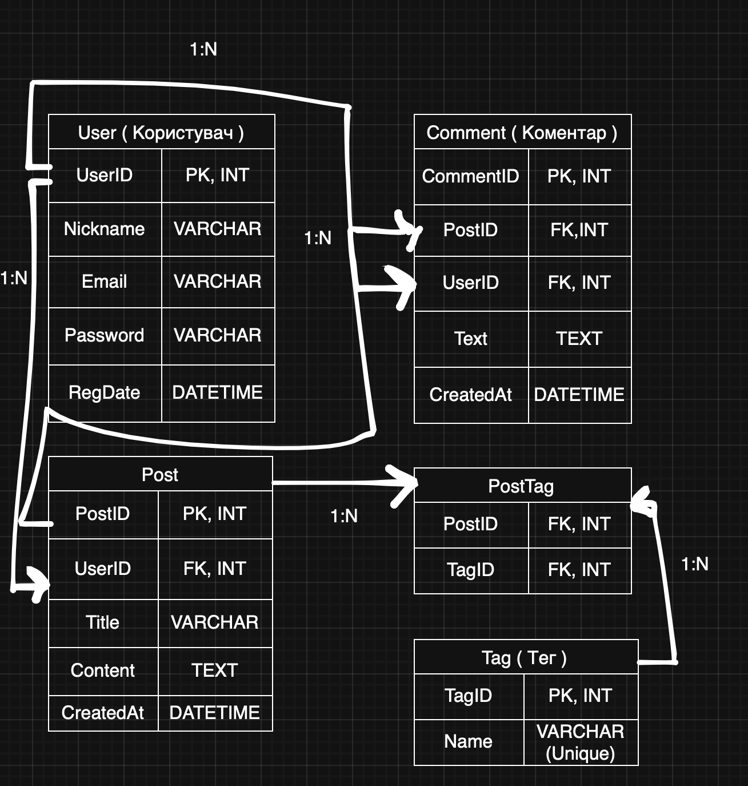

# Звіт з проектування схеми бази даних (Gaming Social Network)

## 1. Огляд схеми бази даних
Розроблена база даних призначена для функціонування ігрової соціальної платформи, де користувачі можуть публікувати контент, класифікувати його за допомогою тегів та залишати коментарі. Схема складається з п'яти таблиць: **users**, **tags**, **posts**, **comments** та **post_tags**.

### Опис таблиць

#### 1.1. Таблиця `users` (Користувачі)
Зберігає облікові дані та інформацію про реєстрацію гравців.

| Стовпець | Тип даних | Обмеження / Ключі | Опис |
| :--- | :--- | :--- | :--- |
| **user_id** | INTEGER | **PRIMARY KEY**, IDENTITY | Унікальний ідентифікатор користувача. |
| **nickname** | VARCHAR(50) | NOT NULL, **UNIQUE** | Нікнейм користувача (не порожній). |
| **email** | VARCHAR(100) | NOT NULL, **UNIQUE** | Електронна адреса користувача. |
| **password** | VARCHAR(255) | NOT NULL | Хешований пароль для входу. |
| **reg_date** | TIMESTAMP | DEFAULT CURRENT_TIMESTAMP | Дата та час реєстрації в системі. |

#### 1.2. Таблиця `tags` (Теги)
Словник категорій для класифікації публікацій за жанрами або темами.

| Стовпець | Тип даних | Обмеження / Ключі | Опис |
| :--- | :--- | :--- | :--- |
| **tag_id** | INTEGER | **PRIMARY KEY**, IDENTITY | Унікальний ідентифікатор тегу. |
| **tag_name** | VARCHAR(50) | NOT NULL, **UNIQUE** | Назва тегу (наприклад, 'RPG', 'Update'). |

#### 1.3. Таблиця `posts` (Публікації)
Зберігає статті, новини та огляди, створені користувачами.

| Стовпець | Тип даних | Обмеження / Ключі | Опис |
| :--- | :--- | :--- | :--- |
| **post_id** | INTEGER | **PRIMARY KEY**, IDENTITY | Унікальний ідентифікатор публікації. |
| **user_id** | INTEGER | **FOREIGN KEY** | Автор поста. `ON DELETE CASCADE`. |
| **title** | VARCHAR(200) | NOT NULL, CHECK (>0) | Заголовок публікації. |
| **content** | TEXT | NOT NULL | Текстовий зміст публікації. |
| **created_at**| TIMESTAMP | DEFAULT CURRENT_TIMESTAMP | Час створення поста. |

#### 1.4. Таблиця `comments` (Коментарі)
Зберігає повідомлення користувачів під відповідними публікаціями.

| Стовпець | Тип даних | Обмеження / Ключі | Опис |
| :--- | :--- | :--- | :--- |
| **comment_id**| INTEGER | **PRIMARY KEY**, IDENTITY | Унікальний ідентифікатор коментаря. |
| **post_id** | INTEGER | **FOREIGN KEY** | Посилання на пост. `ON DELETE CASCADE`. |
| **user_id** | INTEGER | **FOREIGN KEY** | Автор коментаря. `ON DELETE CASCADE`. |
| **comment_text**| TEXT | NOT NULL, CHECK (trim) | Текст коментаря (заборонено порожні). |
| **created_at**| TIMESTAMP | DEFAULT CURRENT_TIMESTAMP | Час написання коментаря. |

#### 1.5. Таблиця `post_tags` (Зв'язок Пост-Тег)
Зв'язуюча таблиця для реалізації зв'язку "багато до багатьох" між постами та тегами.

| Стовпець | Тип даних | Обмеження / Ключі | Опис |
| :--- | :--- | :--- | :--- |
| **post_id** | INTEGER | **PRIMARY KEY**, FK | Посилання на публікацію. |
| **tag_id** | INTEGER | **PRIMARY KEY**, FK | Посилання на тег. |

**Важливі обмеження:**
* Використано **`ON DELETE CASCADE`** для всіх зовнішніх ключів, що забезпечує автоматичне очищення пов'язаних даних при видаленні користувача або публікації.
* Складений первинний ключ **`PRIMARY KEY (post_id, tag_id)`** запобігає дублюванню однакових тегів на одному пості.

---

## 2. ER-діаграма
Нижче наведена структура зв'язків між сутностями:



---

## 3. SQL-скрипт створення та наповнення
Для реалізації схеми та наповнення тестовими даними використано наступний скрипт:

```sql
-- 1. СТВОРЕННЯ ТАБЛИЦЬ
CREATE TABLE users (
    user_id INTEGER GENERATED ALWAYS AS IDENTITY PRIMARY KEY,
    nickname VARCHAR(50) NOT NULL UNIQUE CHECK (length(nickname) > 0),
    email VARCHAR(100) NOT NULL UNIQUE CHECK (length(email) > 0),
    password VARCHAR(255) NOT NULL,
    reg_date TIMESTAMP NOT NULL DEFAULT CURRENT_TIMESTAMP
);

CREATE TABLE tags (
    tag_id INTEGER GENERATED ALWAYS AS IDENTITY PRIMARY KEY,
    tag_name VARCHAR(50) NOT NULL UNIQUE CHECK (length(tag_name) > 0)
);

CREATE TABLE posts (
    post_id INTEGER GENERATED ALWAYS AS IDENTITY PRIMARY KEY,
    user_id INTEGER NOT NULL,
    title VARCHAR(200) NOT NULL CHECK (length(title) > 0),
    content TEXT NOT NULL,
    created_at TIMESTAMP NOT NULL DEFAULT CURRENT_TIMESTAMP,
    CONSTRAINT fk_post_author FOREIGN KEY (user_id) REFERENCES users(user_id) ON DELETE CASCADE
);

CREATE TABLE comments (
    comment_id INTEGER GENERATED ALWAYS AS IDENTITY PRIMARY KEY,
    post_id INTEGER NOT NULL,
    user_id INTEGER NOT NULL,
    comment_text TEXT NOT NULL CHECK (length(trim(comment_text)) > 0),
    created_at TIMESTAMP NOT NULL DEFAULT CURRENT_TIMESTAMP,
    CONSTRAINT fk_comment_post FOREIGN KEY (post_id) REFERENCES posts(post_id) ON DELETE CASCADE,
    CONSTRAINT fk_comment_author FOREIGN KEY (user_id) REFERENCES users(user_id) ON DELETE CASCADE
);

CREATE TABLE post_tags (
    post_id INTEGER NOT NULL,
    tag_id INTEGER NOT NULL,
    PRIMARY KEY (post_id, tag_id),
    CONSTRAINT fk_pt_post FOREIGN KEY (post_id) REFERENCES posts(post_id) ON DELETE CASCADE,
    CONSTRAINT fk_pt_tag FOREIGN KEY (tag_id) REFERENCES tags(tag_id) ON DELETE CASCADE
);

-- 2. НАПОВНЕННЯ ДАНИМИ
INSERT INTO users (nickname, email, password) VALUES 
('Tirsky_D', 'tirsky@kpi.ua', 'pass1'),
('Ferenchuk_Z', 'ferenchuk@kpi.ua', 'pass2'),
('Gamer1', 'g1@ukr.net', 'pass3');

INSERT INTO tags (tag_name) VALUES ('RPG'), ('Cyberpunk'), ('Update'), ('Reviews');

INSERT INTO posts (user_id, title, content) VALUES 
(1, 'Cyberpunk 2077 Update', 'The new patch fixes major bugs...'),
(2, 'The Witcher 4 Saga', 'CD Projekt Red confirmed the new game development.'),
(1, 'Best Indie Games 2026', 'A list of hidden gems this year.');

INSERT INTO comments (post_id, user_id, comment_text) VALUES 
(1, 2, 'Finally! Performance is much better now.'),
(2, 1, 'Hope they bring back Geralt.');

INSERT INTO post_tags (post_id, tag_id) VALUES (1, 2), (1, 3), (2, 1);
