# SELECT

## 1. Показати всіх користувачів
```sql
SELECT * FROM users;
```
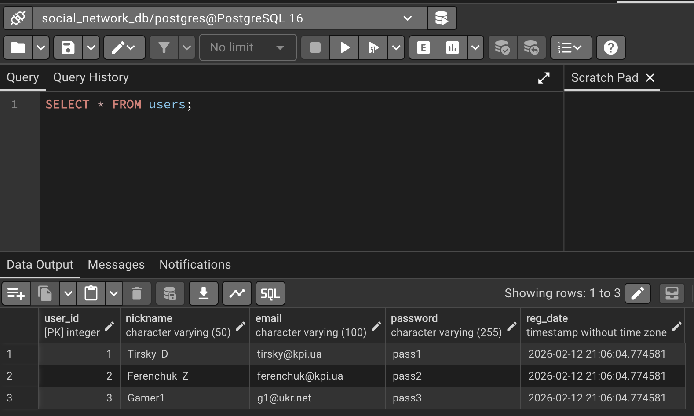

---

## 2. Показати контактні дані
```sql
SELECT nickname, email FROM users;
```
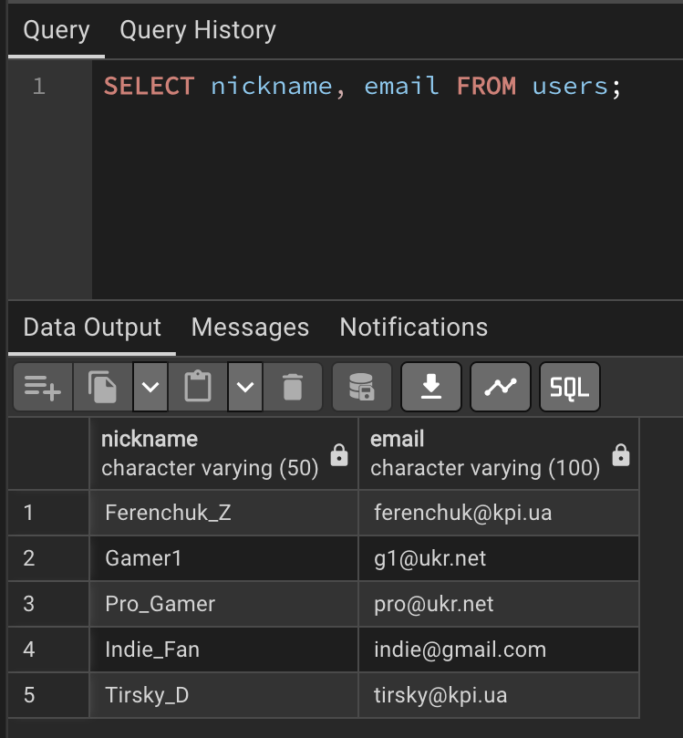

---

## 3. Показати всі доступні теги
```sql
SELECT * FROM tags;
```
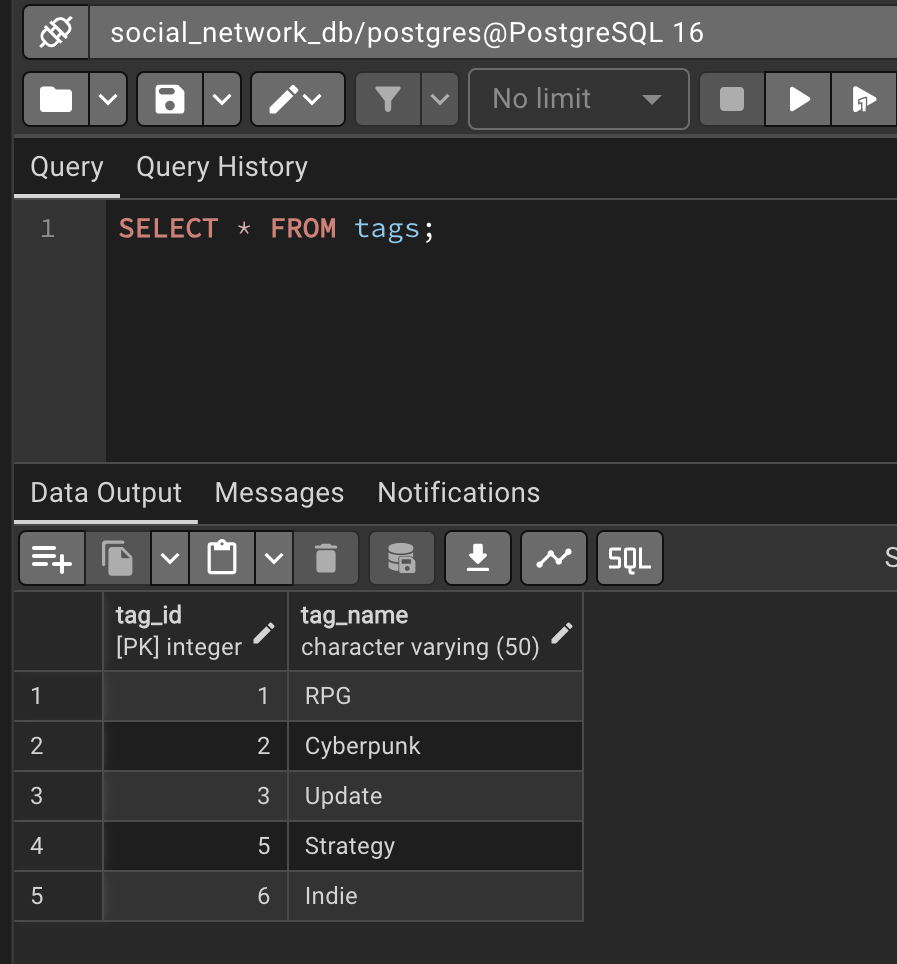

---

## 4. Знайти пости конкретного автора
```sql
SELECT title, created_at FROM posts 
WHERE user_id = 1;
```
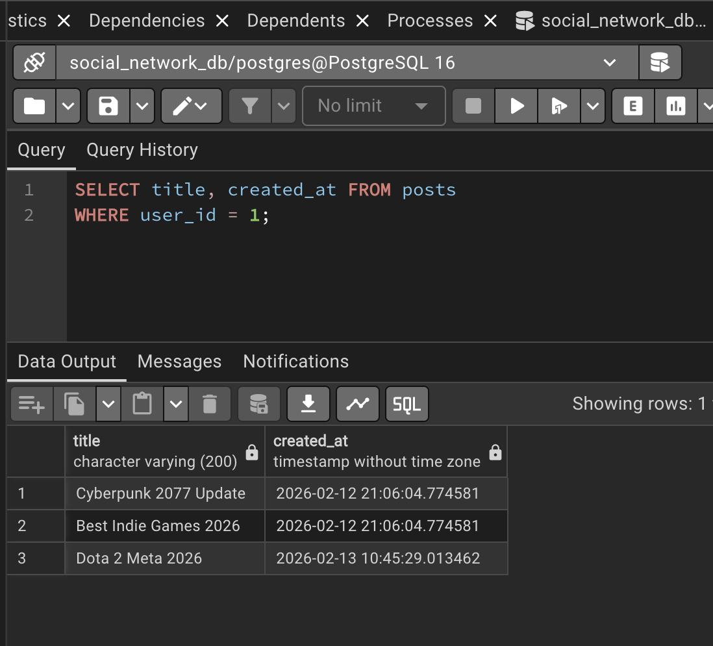

---

## 5. Знайти коментарі за ключовим словом
```sql
SELECT * FROM comments 
WHERE comment_text LIKE '%Performance%';
```
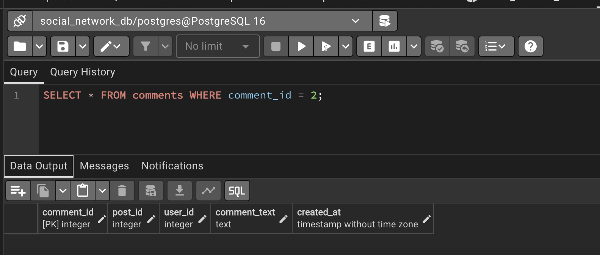

---

## 6. Показати пости разом з іменами авторів
```sql
SELECT 
    users.nickname AS Автор, 
    posts.title AS Заголовок, 
    posts.created_at AS Дата
FROM posts
JOIN users ON posts.user_id = users.user_id;
```
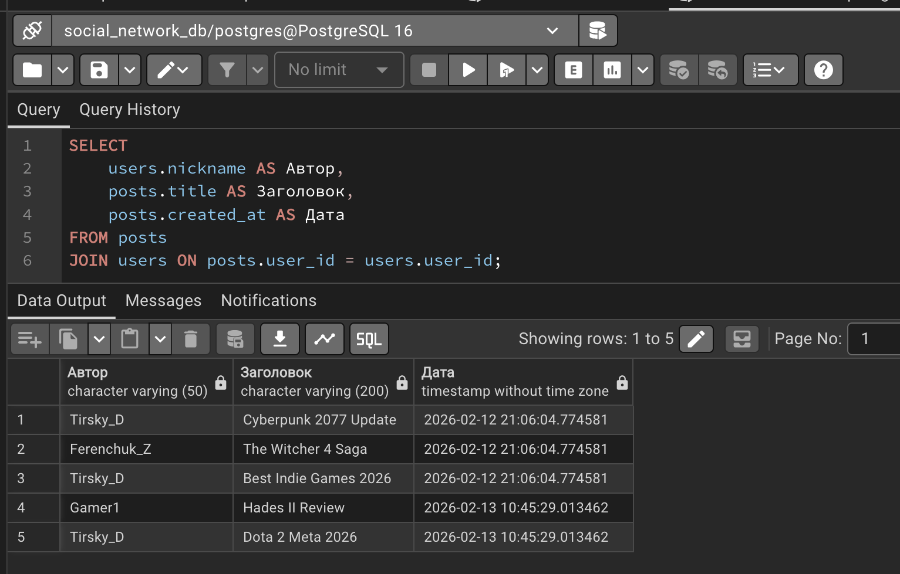

---

# INSERT

## 1. Додавання нового користувача
```sql
INSERT INTO users (nickname, email, password) 
VALUES ('Star_Lord', 'quill@galaxy.com', 'dance_off_2026');

SELECT * FROM users WHERE nickname = 'Star_Lord';
```
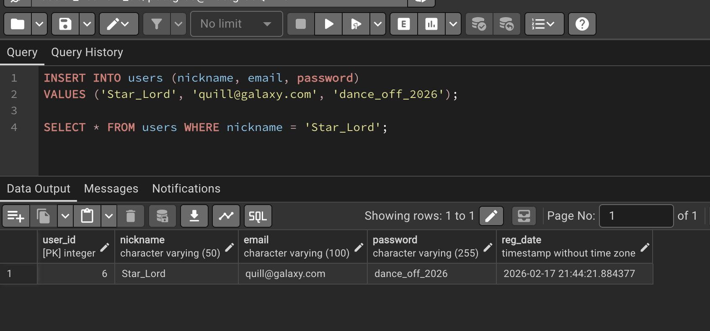

---

## 2. Додавання нової публікації
```sql
INSERT INTO posts (user_id, title, content) 
VALUES (4, 'How to fly a Milano', 'Step 1: Don`t let Rocket drive...');

SELECT * FROM posts WHERE user_id = 4;
```
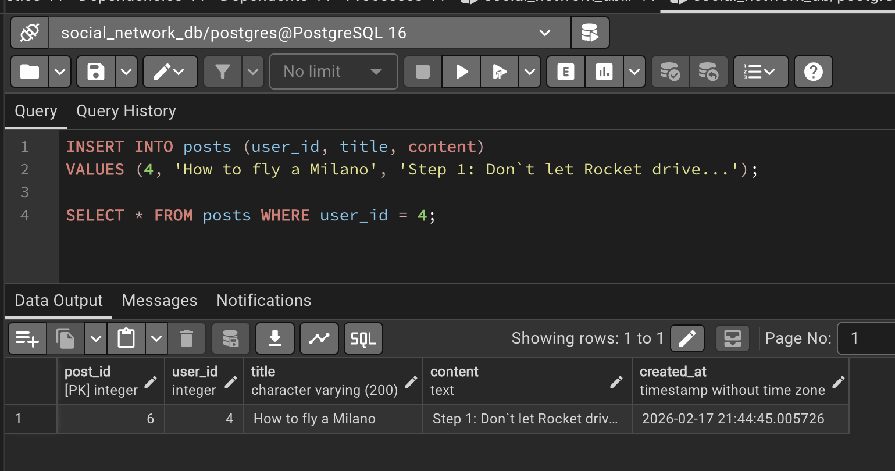

---

# UPDATE

## 1. Оновлення нікнейму користувача
```sql
UPDATE users
SET nickname = 'Tirsky_PRO'
WHERE user_id = 1;

SELECT * FROM users WHERE user_id = 1;
```
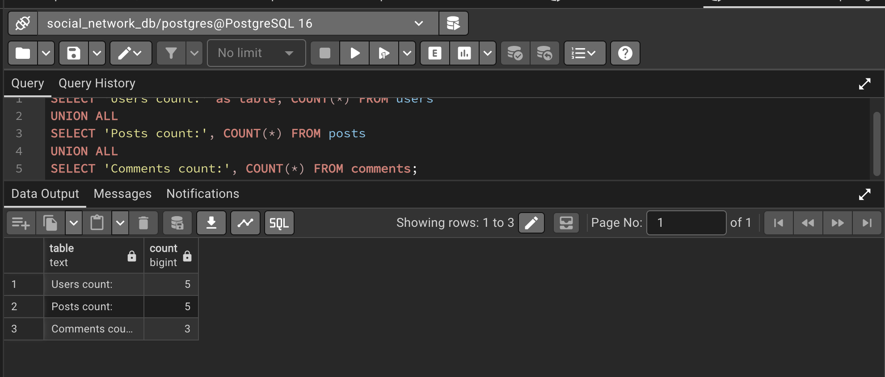

---

## 2. Оновлення змісту публікації
```sql
UPDATE posts
SET content = 'The new patch fixes major bugs and improves FPS by 20%.'
WHERE post_id = 1;

SELECT * FROM posts WHERE post_id = 1;
```
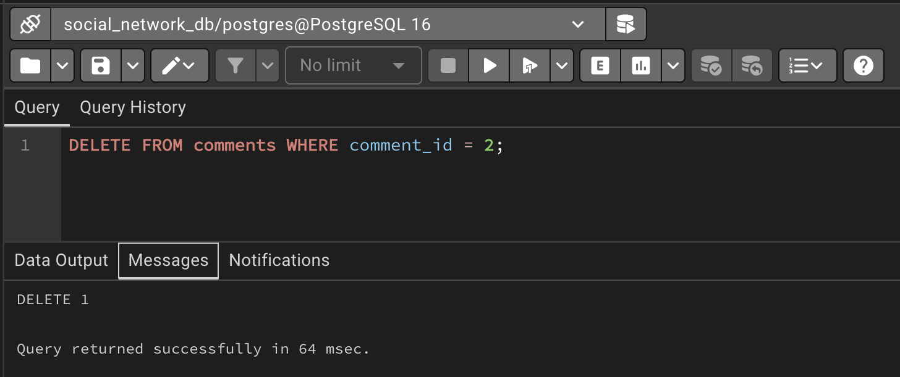

---

# DELETE

## 1. Видалення конкретного коменатря
```sql
DELETE FROM comments
WHERE comment_id = 2;

SELECT * FROM comments;
```
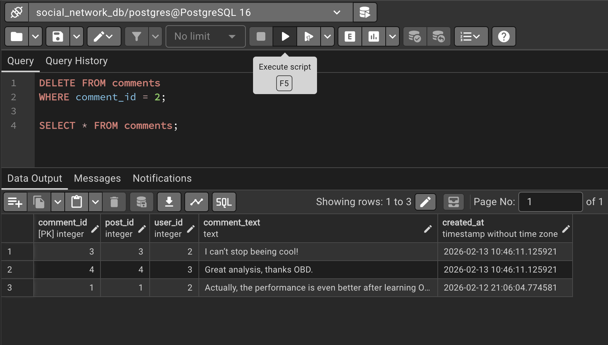

---

## 2. Видалення категорії
```sql
DELETE FROM tags
WHERE tag_name = 'Update';

SELECT * FROM tags;
SELECT * FROM post_tags;
```
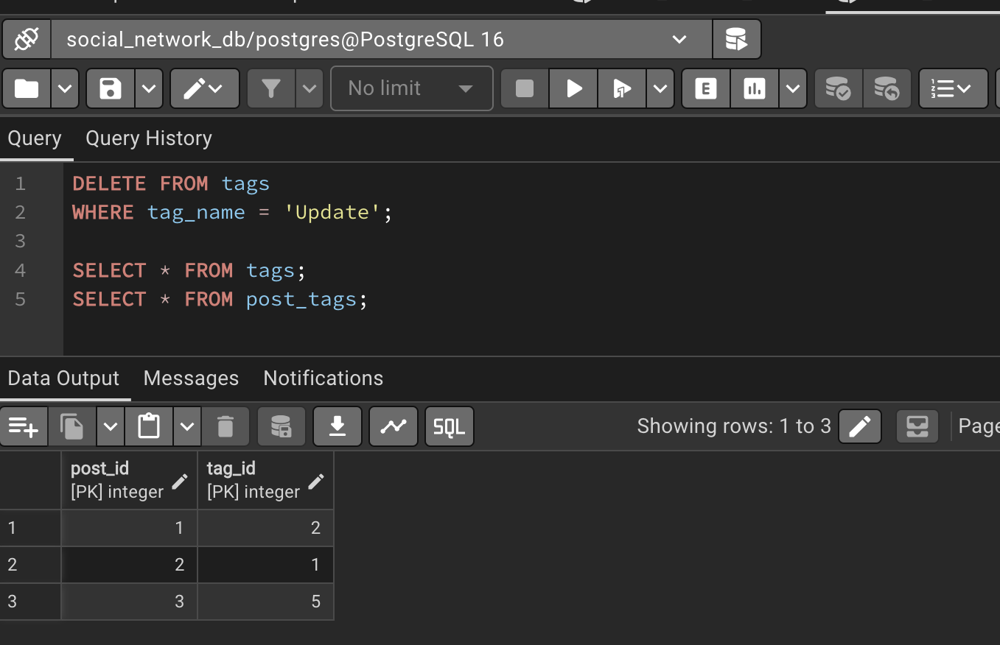

---

