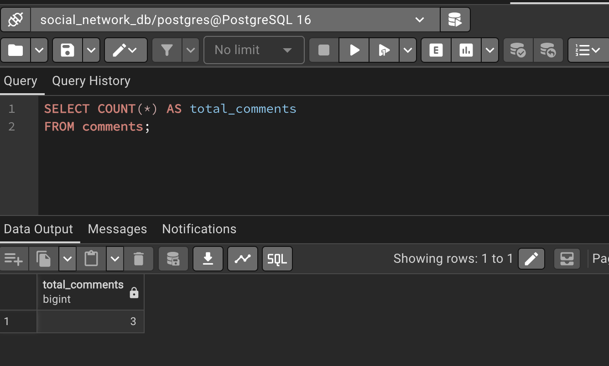
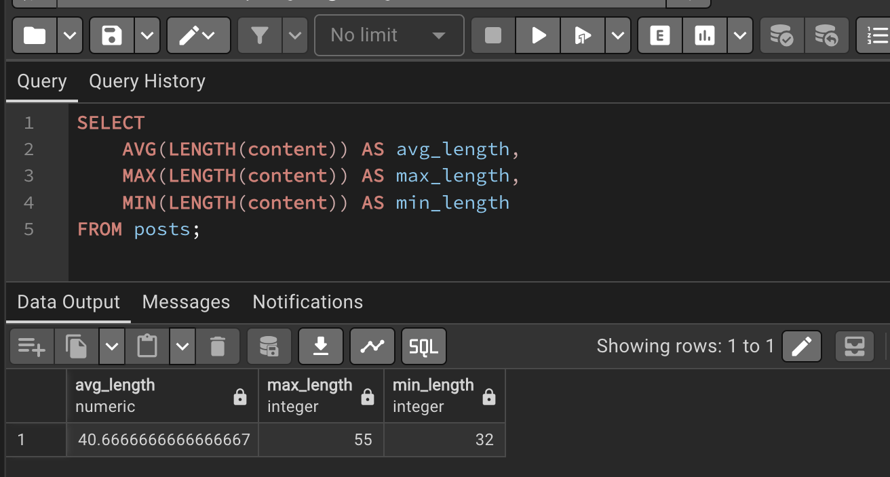
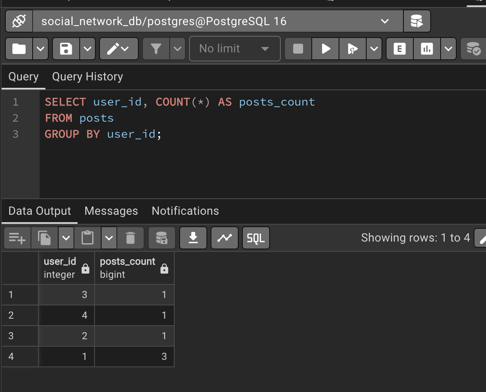
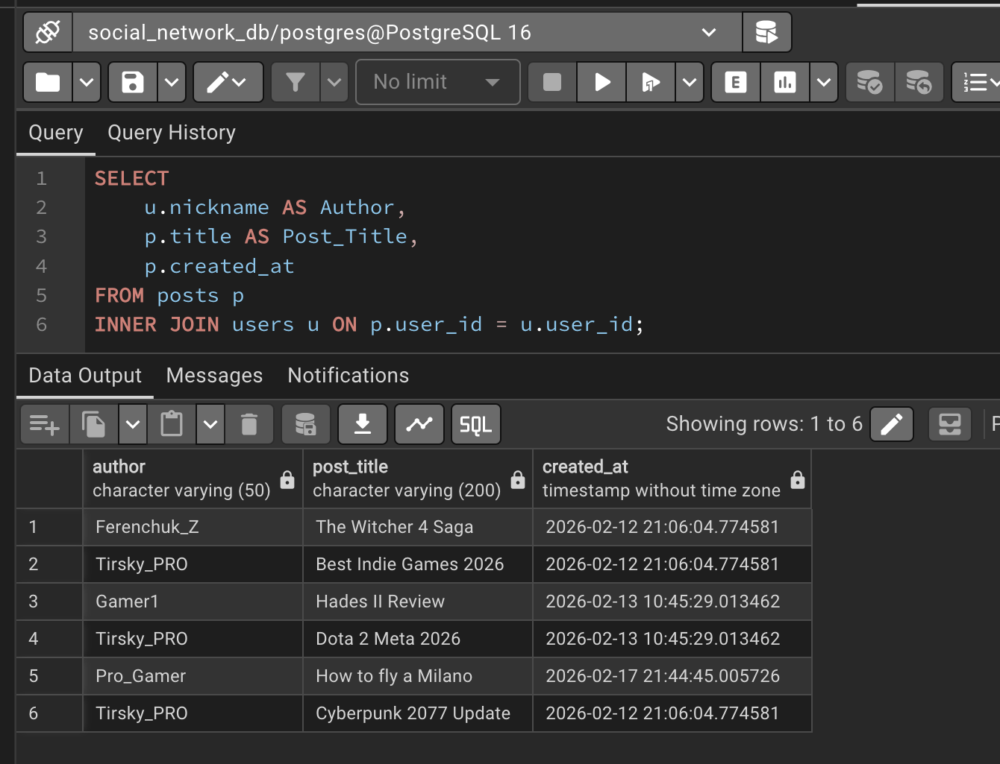
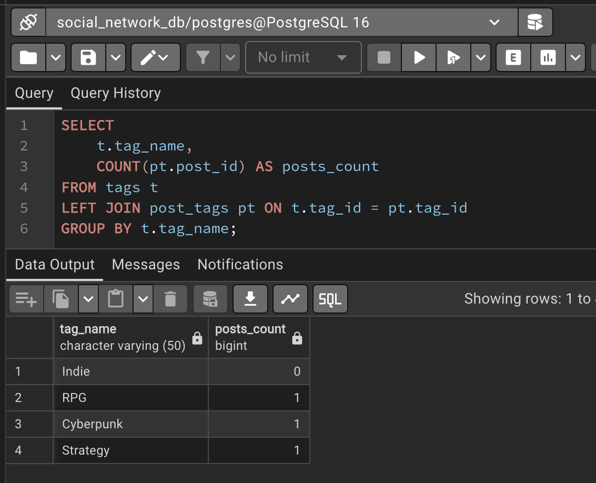
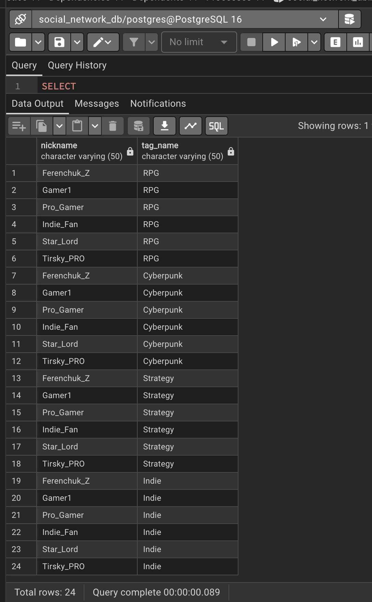
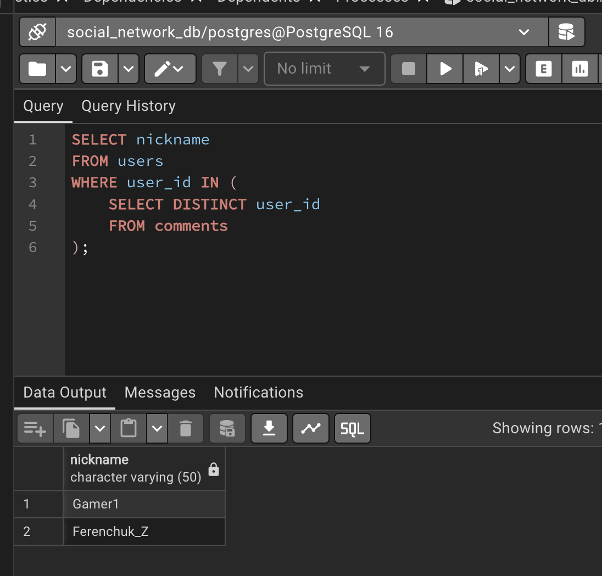
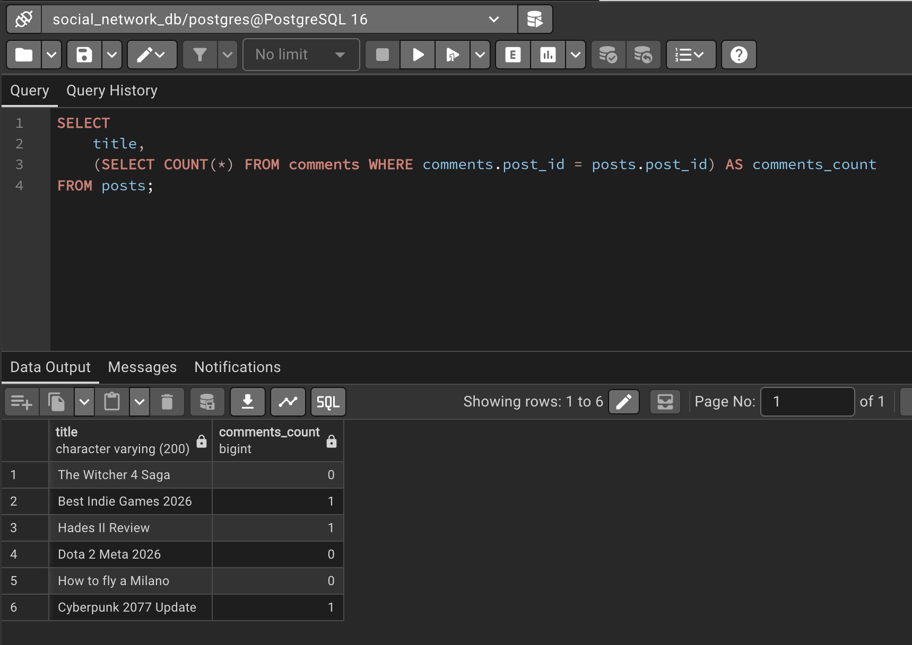
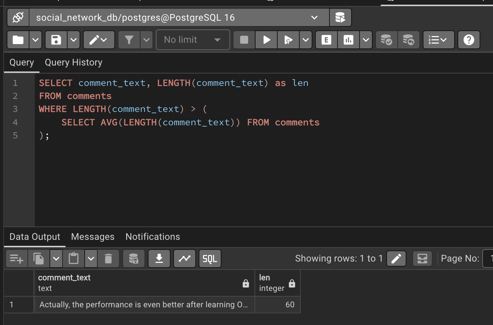

# ЧАСТИНА 1: АГРЕГАЦІЯ ТА ГРУПУВАННЯ (Мінімум 4 запити)

---

## Базова агрегація (COUNT)
Підрахувати загальну кількість голосів у системі.
```sql
SELECT COUNT(*) AS total_comments 
FROM comments;
```


---

## Агрегація (AVG, MAX, MIN)
Проаналізувати довжину текстів постів (символи). Знайти середню, максимальну та мінімальну довжину контенту.
```sql
SELECT 
    AVG(LENGTH(content)) AS avg_length,
    MAX(LENGTH(content)) AS max_length,
    MIN(LENGTH(content)) AS min_length
FROM posts;
```


---

## Групування (GROUP BY)
Підрахувати кількість постів, написаних кожним користувачем (виводимо ID користувача і кількість).
```sql
SELECT user_id, COUNT(*) AS posts_count
FROM posts
GROUP BY user_id;
```


---

## Фільтрування груп (HAVING)
Знайти ID тегів, які були використані більше ніж у 1 пості (популярні теги).
```sql
SELECT tag_id, COUNT(*) AS usage_count
FROM post_tags
GROUP BY tag_id
HAVING COUNT(*) > 1;
```


---

# ЧАСТИНА 2: ОБ'ЄДНАННЯ ТАБЛИЦЬ (JOINs) (Мінімум 3 запити)

---

## INNER JOIN (Багатотаблична вибірка)
Отримати список: Автор коментаря, Заголовок поста, Текст коментаря.
Показує тільки існуючі зв'язки
```sql
SELECT 
    u.nickname AS Comment_Author, 
    p.title AS Post_Title, 
    c.comment_text
FROM comments c
INNER JOIN users u ON c.user_id = u.user_id
INNER JOIN posts p ON c.post_id = p.post_id;
```


---

## LEFT JOIN
Показати всі теги та скільки разів вони використовувалися (навіть якщо тег не використовувався — буде 0).
```sql
SELECT 
    t.tag_name, 
    COUNT(pt.post_id) AS posts_count
FROM tags t
LEFT JOIN post_tags pt ON t.tag_id = pt.tag_id
GROUP BY t.tag_name;
```


---

## CROSS JOIN (Декартовий добуток)
Створити матрицю "всі можливі комбінації".
Показує комбінацію кожного юзера з кожним тегом.
```sql
SELECT 
    u.nickname, 
    t.tag_name
FROM users u
CROSS JOIN tags t;
```


---

# ЧАСТИНА 3: ПІДЗАПИТИ (SUBQUERIES) (Мінімум 3 запити)

---

## Підзапит у WHERE
Знайти нікнейми користувачів, які залишили хоча б один коментар (їх ID є в таблиці коментарів).
```sql
SELECT nickname 
FROM users 
WHERE user_id IN (
    SELECT DISTINCT user_id 
    FROM comments
);
```


---

## Підзапит у SELECT
Вивести назву поста та кількість коментарів до нього, підраховану "на льоту" підзапитом.
```sql
SELECT 
    title, 
    (SELECT COUNT(*) FROM comments WHERE comments.post_id = posts.post_id) AS comments_count
FROM posts;
```


---

## Підзапит з агрегацією (WHERE + Scalar Subquery)
Знайти коментарі, довжина тексту яких більша за середню довжину всіх коментарів.
```sql
SELECT comment_text, LENGTH(comment_text) as len
FROM comments 
WHERE LENGTH(comment_text) > (
    SELECT AVG(LENGTH(comment_text)) FROM comments
);
```


---
